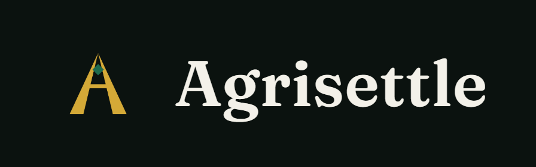

```
██╗  ██╗ █████╗ ██████╗ ██╗   ██╗███████╗███████╗████████╗██╗      ██████╗  ██████╗██╗  ██╗
██║  ██║██╔══██╗██╔══██╗██║   ██║██╔════╝██╔════╝╚══██╔══╝██║     ██╔═══██╗██╔════╝██║ ██╔╝
███████║███████║██████╔╝██║   ██║█████╗  ███████╗   ██║   ██║     ██║   ██║██║     █████╔╝
██╔══██║██╔══██║██╔══██╗╚██╗ ██╔╝██╔══╝  ╚════██║   ██║   ██║     ██║   ██║██║     ██╔═██╗
██║  ██║██║  ██║██║  ██║ ╚████╔╝ ███████╗███████║   ██║   ███████╗╚██████╔╝╚██████╗██║  ██╗
╚═╝  ╚═╝╚═╝  ╚═╝╚═╝  ╚═╝  ╚═══╝  ╚══════╝╚══════╝   ╚═╝   ╚══════╝ ╚═════╝  ╚═════╝╚═╝  ╚═╝
```

Pre-harvest commodity forward commitments on Stellar. A cooperative and a buyer agree
price and quantity before harvest; the buyer's deposit sits in a Soroban escrow and
releases against an independent warehouse operator's grading receipt, not against
either party's say-so. A capped, tranched advance reaches the cooperative before
harvest. Each member farmer's share is recorded on chain at lock-in.

[](https://github.com/Agrisettle/HarvestLock/actions/workflows/api.yml)
[](https://github.com/Agrisettle/HarvestLock/actions/workflows/buyer-app.yml)
[](https://github.com/Agrisettle/HarvestLock/actions/workflows/coop-pwa.yml)
[](https://github.com/Agrisettle/HarvestLock/actions/workflows/site.yml)
[](https://github.com/Agrisettle/HarvestLock-Contracts/actions/workflows/test.yml)
[](./LICENSE)

**Full PRD:** [`docs/PRD.md`](./docs/PRD.md) — currently v0.7

**Roadmap:** [`ROADMAP.md`](./ROADMAP.md)

## Status: pre-pilot, work in progress

**This is not production software and shouldn't be treated as such.**
No cooperative or buyer has actually used HarvestLock yet — there's no
pilot partner signed, no mainnet deployment, no real money has ever
moved through any of this. Everything described below is real, tested,
and verified against live Stellar *testnet*, which is a meaningfully
different claim from "ready for real users." The Open Questions in the
PRD (§12) are what has to be resolved with an actual counterparty
before that changes, regardless of how much gets built in the
meantime. Treat every "done" below as "done for testnet," not "done."

With that framing — what's actually real, not just specified:

- **Contract** (`HarvestLock-Contracts`): the full state machine —
  happy path, claimable-balance-with-expiry advance tranches, mutual
  cancellation, buyer-position assignability, two-phase funding with
  buyer-default/seller-non-delivery forfeiture, and the PRD §7
  shortfall/grade adjustment schedule at settlement. 67/67 tests,
  deployed and exercised live on testnet six times.
- **`api/`**: the full lifecycle (deploy through settle, including
  `cancel`/`reassign_buyer`'s multi-party staged signing) builds and
  submits against live testnet, not mocked. Off-chain reputation/strike
  tracking backs the buyer-default and forfeiture paths.
- **`coop-pwa`/`buyer-app`**: real write actions (lock, settle, claim
  advances, propose/approve cancel or reassign) against the live API
  via Freighter, browser-verified — not just read-only dashboards.
- **`site/`**: built, public, includes a live badge reading the
  reference contract's real current state.

See `HANDOFF.md` for the honest current-state breakdown (what's real
vs. deliberately deferred, per component) and `ROADMAP.md` for what
happens next and in what order.

## Repositories

The Soroban contract lives in its own repo — separate audit trail and release
cadence from application code. This repo is everything else.

| Repo | Contents |
|---|---|
| [`HarvestLock-Contracts`](https://github.com/Agrisettle/HarvestLock-Contracts) | Soroban escrow contract (Rust) — the state machine in PRD §4.8 |
| [`HarvestLock`](https://github.com/Agrisettle/HarvestLock) *(this repo)* | Public site, API, both product frontends, docs, roadmap |

## Repository layout

```
site/         Public site (React/Vite) — the project's public face, not a logged-in product surface
api/          HarvestLock API (TypeScript/Node, Fastify) — contract lifecycle is real today; allocation/vouchers/attestation intake are planned, not built (see api/HANDOFF.md)
coop-pwa/     Cooperative-facing dashboard (React/Vite) — real write actions against live testnet; phone-auth and offline-tolerance still ahead
buyer-app/    Buyer/off-taker dashboard (React/Vite) — real write actions against live testnet; ERP integration still ahead
docs/         PRD pointer and supporting research notes
```

Stack rationale is in PRD §17. Short version: Rust for the contract because Soroban
requires it, TypeScript everywhere else for a two-person team, Postgres for app state
and the NDPA-compliant off-chain identity map, SDP deployed (never forked) for
farmer payouts, SMS-only for farmers — no app, because seasonal usage (PRD §13, P3)
means nobody will install or retain one.

## CI

Every push and PR to `main` runs typecheck/lint/build/test for each
component that changed (path-scoped — touching `api/` doesn't trigger
`site/`'s workflow, and vice versa). The badges above reflect `main`'s
current state, not any particular commit — a red badge means something
on `main` is actually broken; check the linked workflow run for which
commit and why. `api/`'s CI intentionally does not run its live-testnet
suite (`npm test`) — that needs a funded key as a repo secret, a
decision not yet made — see `CONTRIBUTING.md`.

## Deployment

`coop-pwa` and `buyer-app` deploy together as one Vercel project, one
domain — not two separate deployments with two separate URLs. Their
code stays exactly as it is (still two apps, still deliberately not
merged — see each app's `TASKS.md` entries for why), but the repo root's
`vercel.json`/`vercel-build.sh` build both and stitch the output into
`/buyer/`, `/coop/`, and a landing page at `/` that links to each
(`landing/index.html`). Each app's `vite.config.ts` only switches its
build `base` to a subpath when Vercel's own `VERCEL=1` build env var is
set — local `npm run dev`/`npm run build` in either app still runs at
root, unaffected.

To deploy: point a Vercel project at this repo root (not a subdirectory)
and set `VITE_API_URL` in the Vercel project's environment variables to
wherever `api/` ends up hosted — Vercel's build step doesn't run the API
itself (it's a long-running Fastify/Postgres service, not a static
build or serverless function), so that still needs its own host. The
root `render.yaml` is a ready-to-use blueprint for that: import it as a
new Render Blueprint and it provisions both the Postgres database and
the API web service in one step (one secret, `DEPLOYER_SECRET_KEY`,
still needs filling in by hand afterward — see `render.yaml`'s comments).

`site/` is a separate app with its own deploy story (see `site/README.md`)
and isn't part of this combined build.

## Contributing

Read [`CONTRIBUTING.md`](./CONTRIBUTING.md) before opening a PR — it
covers local setup for every component and what a good PR looks like
here. Security issues specifically go through [`SECURITY.md`](./SECURITY.md),
not a public issue.

## Organization

<a href="https://github.com/Agrisettle"></a>

Part of [Agrisettle](https://github.com/Agrisettle) — settlement infrastructure
for agricultural commodity trade, of which HarvestLock is the first product.

## License

Apache-2.0 — see [`LICENSE`](./LICENSE).
